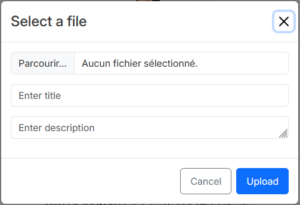
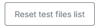

# JSON Manager (SPA)

> This is an online application to manage JSON files.

---

## Features

- Upload JSON with live validation
- Browse uploaded JSON files
- Persistent local cache
- Files deletion

---

## How-to use

### Access and registration

The application lives in at this address: [https://c-test-b86fb.web.app/](https://c-test-b86fb.web.app/).  
Once on this page, there is no need to log-in as you are merely messing with your own browser LocalStorage.

### Inputs validation

When uploading your file, some restrictions will apply:



#### File

- The uploaded file name must end with .json
- There is **no constraint** regarding the formatting of the contained JSON. Uploading an invalid/malformed JSON file will display a warning.

#### File name

- The name can only contain English alphabet and numbers, underscores and dashes
- The maximum length is 32 characters
- The name is expected to contain the string: `42c-loicpennamen`

#### Description

- The maximum length is 128 characters
- The name can **not** contain the string: `42c-loicpennamen`

### Additional features

As you may be testing this app with fictional data, a **Reset button** was added to restore the demonstration list
of files.



---

## The nerds corner

### Technical stack

- Angular 17 (SPA)
- NgRx for state management
- NgBootstrap for styling and components
- Firebase Hosting
- Nx Monorepo for project structure

### Run locally

```bash
git clone https://github.com/loicpennamen/json-manager.git
cd json-manager
npm install
nx serve json-manager
```

---

## Roadmap

There will likely be no future enhancements to this app,
as learning NgRx in the scope of a technical test was heavily time-consuming.

> _Disclaimer:_ Prior to this project, my relationship with NgRx was purely theoretical.  
> It’s now slightly more practical... and deeply humbling.

---

## License

MIT © 2025 42Crunch
